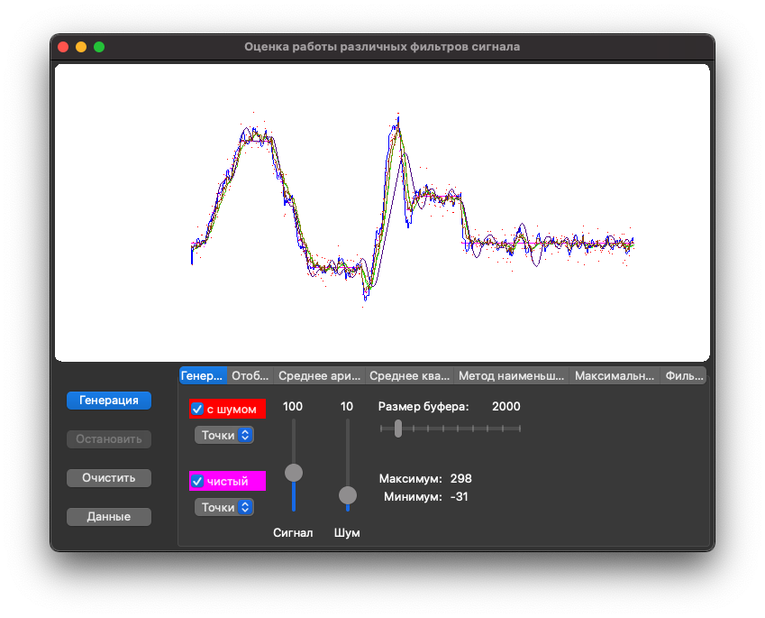
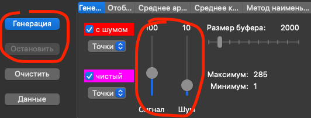
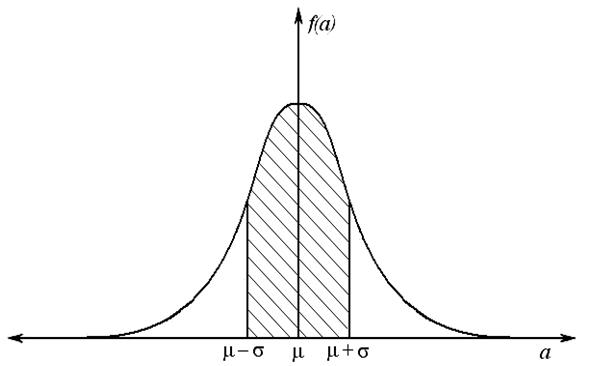
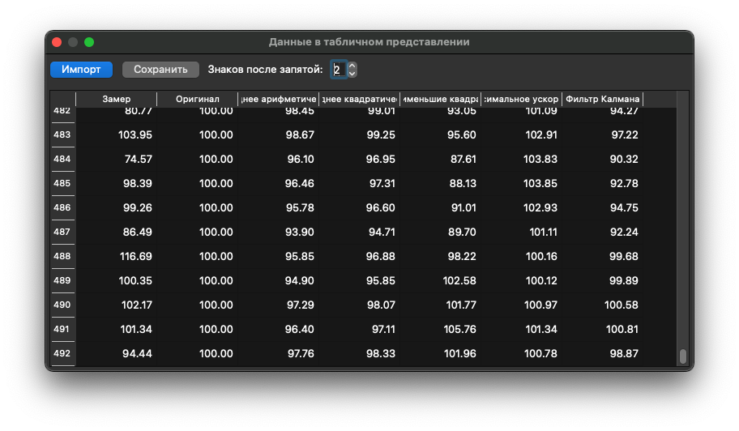
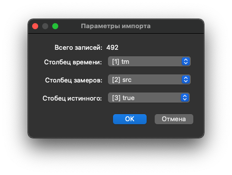

# Анализатор фильтров измеряемых параметров

При замере различных параметров (температура, давление и т.п.) часто требуется отфильтровавывать значения,
т.к. датчик может шуметь, выдывать колеблющееся значение.

Есть ряд алгоритмов, позволяющих сгладить исходные данные.

Данное приложение проверяет работу [таких фильтров](doc/filter.md) на симулированных или реальных данных.

## Генератор сигнала

* `Запускается` и `останавливается` одноимёнными кнопками.

* Регулировать `уровень` можно прямо в процессе генерации.

    Минимум и максимум регулятора уровня соответствуют верхней и нижней точке видимой области графиков.

* Шумы имитируются генератором случайных чисел в пределах указанного диапазона нормальным распределением (по Гауссу).

    
    
    * `μ` - текущий уровень сигнала
    * `σ` - уровень шума

* Размер буфера - количество хранимых значений (новые значения будут вытеснять самые старые).

* Интеррвал генерации - 100 мс.

## Отображение

На этой закладке показаны общие параметры:

* `Масштаб` - меняется скроллом мышки над графиками.
    
    * С зажатой кнопкой `Shift` (MacOS) или `Alt` (Windows) растягивается вертикаль (уровень сигнала).
    
    * Без зажатых кнопок меняется горизонталь (шкала времени).
    
    * Курсор мыши указывает на точку, которая сохранит своё положение при изменении масштаба.

* `Смещение` - меняется перетаскиванием мышкой графиков.

* Вертикальное смещение, вертикальный масштаб и вертикальный размер области графиков влияют на границы работы регулятора уровня сигнала.

    Минимум и максимум регулятора уровня соответствуют верхней и нижней точке видимой области графиков.

## Библиотека фильтров

Все используемые фильтры организованы в виде библиотек на языке C++ - для удобства использования в различных проектах.

Регуляторы параметров находятся на одноимённых закладках для каждого фильтра. На этих закладках можно изменить тип отрисовки и скрыть отображение данного фильтра.

[Описание фильтров](doc/filter.md)

## Табличные данные

* Открываются с помощью кнопки `Данные`.

* При выделении строки в таблице на графиках отобразится вертикальная линия, соответствующая данной строке (и наоборот - при клике мышкой в нужной точке на графике).

* При загрузке данных необходимо выбрать столбцы:

    

    * `Время` - хранит последовательно время замеров
    
    * `Замеряемый сигнал` - реальные данные вместе с шумами
    
    * `Истинный сигнал` - [необязательно] исходный сигнал без шумов, если такие данные есть

* При загрузке данных буфер при необходимости будет увеличен автоматически, чтобы вместить все данные из исходного файла.
