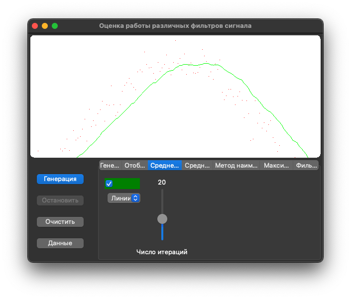
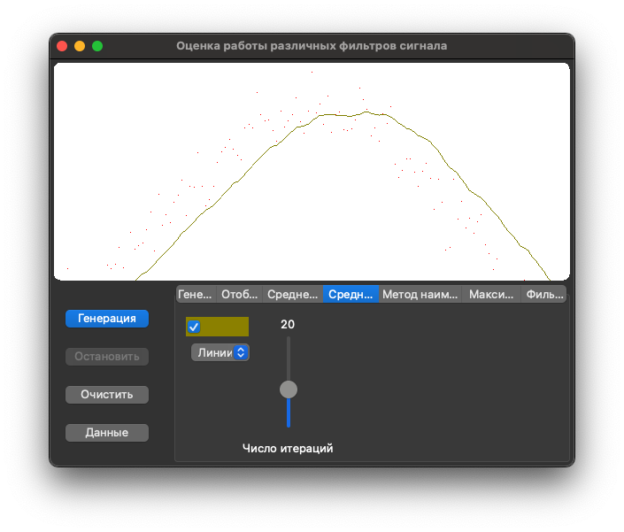
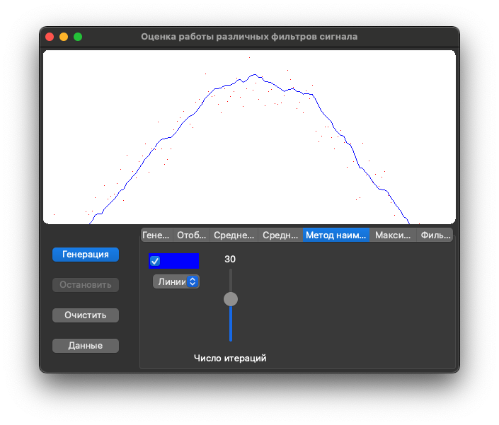
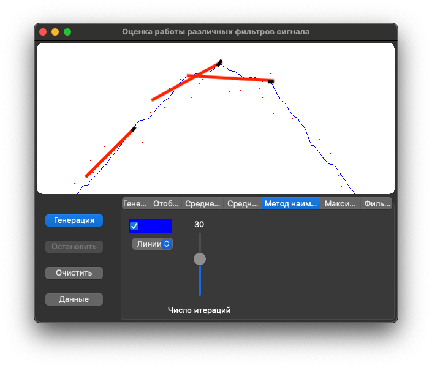
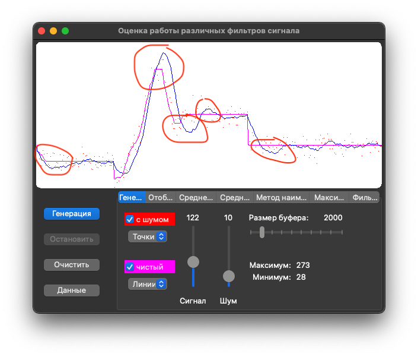
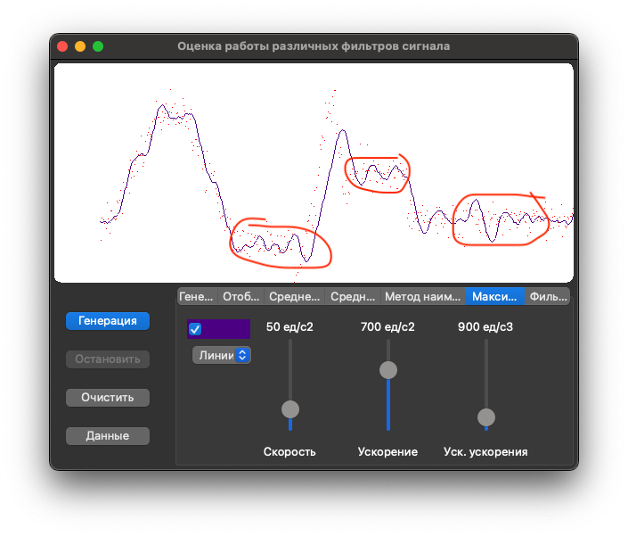
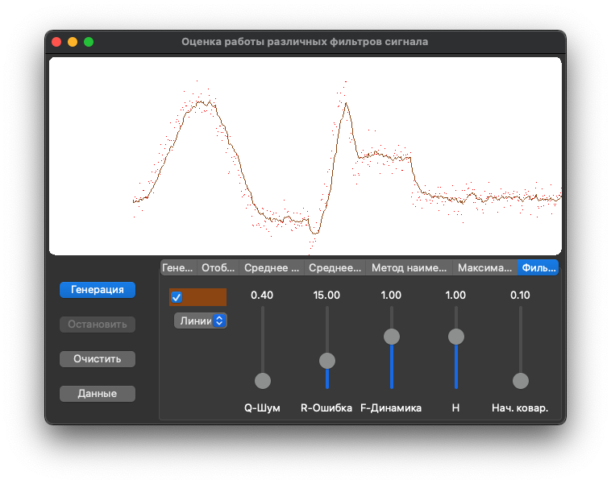

# Применяемые фильтры

Все фильтры приведены к общему принципу:

* Параметры, указываемые при инициализации (обычно их можно поменять в процессе).

* При каждом замере вызываем метод tick(val, tdiff), где:

    * val - текущее измеренное значение
    
    * tdiff - целое, означающее время, прошедшее с предыдущего замера

* На выходе фильтра параметры, получаемые методами:

    * value() - отфильтрованное значение
    
    * speed() - текущая скорость изменения (в тех же единицах, в которых указаны значение и время)

## Среднее арифметическое

* Модуль: filter_avg.h

* Имя класса (шаблона): FilterAvg

* Параметры:

    * `size` - Число итераций, количество хранимых значений (более новые вытесняют самые старые).

* Пример:

```cpp
    FilterAvg <double> filter(20);
    
    void loop() {
        static uint32_t m = 0;
        uint32_t m1 = millis();
        
        double val = measure();
        
        val = filter.tick(val, m1-m);
        m = m1;
    }
```



    value() = (val1 + val2 + ... + valn) / size

    speed() = (valn - val1) / (tdiff2 + tdiff3 + ... + tdiffn)

Опоздание отфильтрованного значения от истинного: Половина хранимого времени

## Среднее квадратическое

* Модуль: filter_avg2.h

* Имя класса (шаблона): FilterAvg2

* Параметры:

    * `size` - Число итераций, количество хранимых значений (более новые вытесняют самые старые).

* Пример:

```cpp
    FilterAvg2 <double> filter(20);
    
    void loop() {
        static uint32_t m = 0;
        uint32_t m1 = millis();
        
        double val = measure();
        
        val = filter.tick(val, m1-m);
        m = m1;
    }
```



    value() = sqrt( (val1*val1 + val2*val2 + ... + valn*valn) / size )

    speed() = (value() - val_prev) / tdiffn

Скорость в этом фильтре - между двумя крайними отфильтрованными значениями.

На большом числе итераций мало отличается от среднего арифметического. На меньшем числе итераций считается более точным.


## Метод наименьших квадратов

* Модуль: filter_ltsqrt.h

* Имя класса (шаблона): FilterLtSqrt

* Параметры:

    * `size` - Число итераций, количество хранимых значений (более новые вытесняют самые старые).

* Пример:

```cpp
    FilterLtSqrt <double> filter(30);
    
    void loop() {
        static uint32_t m = 0;
        uint32_t m1 = millis();
        
        double val = measure();
        
        val = filter.tick(val, m1-m);
        m = m1;
    }
```



Суть метода заключается в линейной (первого порядка) интерполяции значений.
В каждый момент времени вычисляется уравнение прямой, проходящей примерно посередине всех хранимых значений.
Среднеквадратическое отклонение измеренных точек от этой прямой должно быть минимальным.



Алгоритм взят [отсюда](http://www.cleverstudents.ru/articles/mnk.html), 
[отсюда](https://ru.wikipedia.org/wiki/%D0%9C%D0%B5%D1%82%D0%BE%D0%B4_%D0%BD%D0%B0%D0%B8%D0%BC%D0%B5%D0%BD%D1%8C%D1%88%D0%B8%D1%85_%D0%BA%D0%B2%D0%B0%D0%B4%D1%80%D0%B0%D1%82%D0%BE%D0%B2)
и [отсюда](http://mathprofi.ru/metod_naimenshih_kvadratov.html).

Вспомогательные величины:

* Суммарное время за весь хранимый интервал (длина по оси `x`)

    tm = tdiff2 + tdiff3 + ... + tdiffn

* Сумма всех координат по оси `x`

    tm1 = 0
    
    tm2 = tdiff2
    
    tm3 = tdiff2 + tdiff3
    
    ...
    
    tmn = tm = tdiff2 + tdiff3 + ... + tdiffn
    
    sx = tm1 + tm2 + tm3 + ... + tmn
    
* Сумма квадратов всех координат по оси `x`

    sx2 = tm1*tm1 + tm2*tm2 + tm3*tm3 + ... + tmn*tmn

* Сумма всех значений по оси `y`
    
    sy = val1 + val2 + val3 + ... + valn

* Сумма произведений координат по оси `x` и по оси `y`

    sxy = tm1 * val1 + tm2 * val2 + ... + tmn * valn
    
* Коэфициенты `a` и `b` в итоговой формуле прямой

    a = (sxy * size - sx * sy) / (sx2 * size - sx * sx)
    
    b = (sy - a * sx) / size

    Коэфициент `a` означает наклон этой прямой, что фактически соответствует
    скорости

* Итоговые значения

    value() = a * tm + b

    speed() = a

Данный метод гораздо лучше работает на большом числе итераций (количестве хранимых значений),
чем среднее арифметическое или среднее квадратическое. При этом гораздо меньше запаздывает.

Но у этого метода есть одна особенность: при резком изменении скорости возникает петля запаздывания,
которая как раз напрямую зависит от числа хранимых значений.



## Максимальное ускорение

* Модуль: filter_maxaccel.h

* Имя класса (шаблона): FilterMaxAccel

* Параметры:

    * `speed` - Максимальная скорость.

    * `accel` - Максимальное ускорение.

    * `acc2` - Максимальная скорость изменения ускорения.

* Пример:

```cpp
    FilterMaxAccel <double> filter(0.05, 0.00001, 1);
    
    void loop() {
        static uint32_t m = 0;
        uint32_t m1 = millis();
        
        double val = measure();
        
        val = filter.tick(val, m1-m);
        m = m1;
    }
```



Метод строится на принципе невозможности слишком больших скоростей изменения измеряемого параметра.

Хорошо применять для динамически небыстро изменяемых величин по отношению к частоте замеров.

Настройка фильтра заключается в подборке параметров ограничений для конкретной модели поведения.

Характерная особенность - при пережатии параметров (особенно - ускорения и изменения ускорения) появляется
синусоидальная пульсация.

## Фильтр Калмана

* Модуль: filter_kalman.h

* Имя класса (шаблона): FilterKalman

* Параметры:

    * `Q` - шум процесса.

    * `R` - ошибка измерения, может быть определена испытанием измерительных приборов.

    * `F` - переменная описывающая динамику системы.

    * `H` - матрица определяющая отношение между измерениями и состоянием системы.

    * `Covar` - начальное значение ковариационной матрицы.

* Пример:

```cpp
    FilterKalman <double> filter(0.4, 15);
    
    void loop() {
        static uint32_t m = 0;
        uint32_t m1 = millis();
        
        double val = measure();
        
        val = filter.tick(val, m1-m);
        m = m1;
    }
```



Фильтр Калмана - это не какой-то определённый алгоритм, а скорее идея, где формула отфильтрованного сигнала:

    v = K * z + (1 - K) * x;
    
    где: `z` и `x` - это прогнозируемое и измеряемое значение, а `K` - это и есть коэффициент Калмана.

В Интернетах много алгоритмов этого фильтра, они разные, но суть их всех сводится к определению `прогнозируемого значения` и 
`коэффициента Калмана` в динамике на каждом замере.

Несмотря на математическое образование, я не смог разобраться ни в одном из этих алгоритмов. 
И конкретно этот взял в [этой статье](https://habr.com/ru/post/166693/).

## Среднее арифметическое круговых величин

* Модуль: filter_avgdeg.h

* Имя класса (шаблона): FilterAvgDeg

* Параметры:

    * `size` - Число итераций, количество хранимых значений (более новые вытесняют самые старые).

* Пример:

```cpp
    FilterAvgDeg <double> filter(20);
    
    void loop() {
        static uint32_t m = 0;
        uint32_t m1 = millis();
        
        double val = measure();
        
        val = filter.tick(val, m1-m);
        m = m1;
    }
```

Этот фильтр применяется только для круглых чисел (например: угол отклонения компаса, навигационное направление движения в градусах и т.п.)
и отсутствует в симуляторе.

В целом, поведение фильтра соответствует "среднему арифметическому".

С той лишь разницей, чтобы при вычислении среднего между углами в 350° и 10° получить 0°, а не 180°, как это было бы при обычном вычислении среднего.

Описание подробно изложено [тут](https://tftwiki.ru/wiki/Mean_of_circular_quantities) (не знаю, является ли эта страница первоисточником).

Суть в том, чтобы получив сумму синусов и сумму косинусов, поделить одно на другое и получить тангенс. Делить суммы синусов/косинусов на количество необязательно, т.к. оно всё равно сократится при делении одного на другое.

    sumsin = sin(ang1) + sin(ang2) + ... + sin(angn)
    
    sumcos = cos(ang1) + cos(ang2) + ... + cos(angn)
    
    value() = atan2(sumsin, sumcos); // = atan(sumsin / sumcos);

Нельзя обойтись только синусом или только косинусом, т.к. график этих функций всегда симметричен вокруг какого-нибудь градуса, что украдёт половину значений на окружности в 360°, т.е. отфильтрованные значения останутся только в диапазоне с разницей в 180°.
